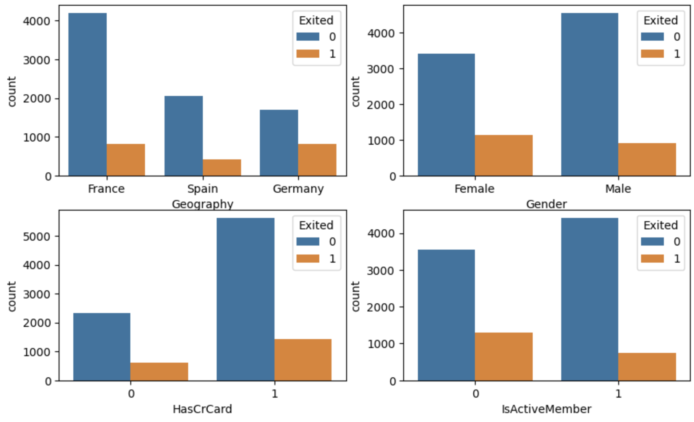
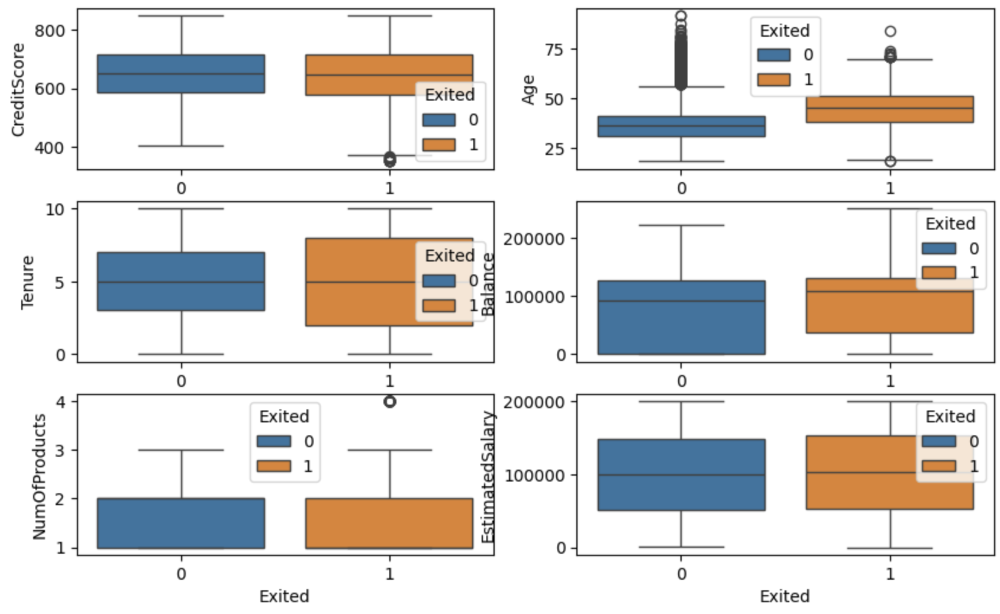
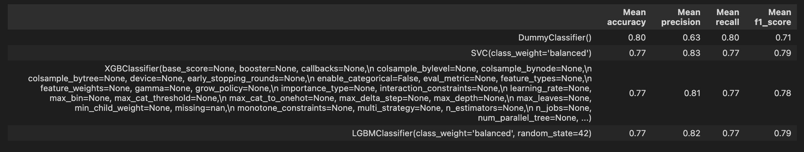
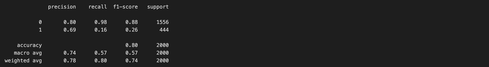

# Customer Churn Prediction for a Bank
## Business Problem
Customer churn is a critical issue for Banks, leading to revenue loss, low customer engagement and increased acquisition costs. This project aims to predict customer churn by identifying key factors influencing retention and enabling businesses to take proactive measures.

## Business Questions
- Which customers are most likely to churn?
- What are the key drivers of customer churn?
- How can the company optimize retention strategies to reduce churn?
- What is the expected revenue impact if churn is reduced?

## Data Overview & Preparation Steps
### Data Overview
The dataset contains customer demographics, account information, and usage patterns. Key features include:
- Demographics: Age, gender, geography
- Account Details: Tenure, number of products, credit score, balance
- Behavioral Factors: Transactions, activity levels.

### Data Collection
The dataset was sourced from public datasets.
https://www.kaggle.com/datasets/mervetorkan/churndataset

### Data Preparation & Feature Engineering
- Preprocessing: Handling missing values, encoding categorical variables, scaling numerical features.
- Feature Engineering: Creating new variables such as balance per estimatedSalary.

## Methodologies
### Tools: 
Python, Pandas, NumPy, Scikit-learn, Tensorflow, Matplotlib, Seaborn

### Techniques:
- Machine Learning Models: Support Vector Machine (SVM), Gradient Boosting (LightGBM, GXBoost), Deep Learning (Sequential Model)
- Feature Selection: Using Boruta for selecting the most important predictors and Heatmap
- Hyperparameter Tuning: Using GridSearchCV for model optimization
- Model Evaluation: Cross-validation with StratifiedKFold, precision-recall analysis

## Results

- Which customers are most likely to churn?
The analysis reveals that customers most likely to churn are those from Germany, female customers, and inactive members who have not engaged with their accounts. Additionally, customers with higher balances, contrary to expectations, exhibit a higher churn rate, suggesting possible dissatisfaction despite significant deposits. Older customers are also more prone to leaving, indicating that engagement strategies for this demographic may be lacking.

- What are the key drivers of customer churn?
Key drivers of churn include low engagement, where customers with fewer products and inactive accounts are more likely to leave. Demographics, particularly gender, show that female customers churn more frequently.

- How can the company optimize retention strategies to reduce churn?
To optimize retention, the company should prioritize proactive engagement with inactive customers, offering personalized incentives and targeted communication. High-balance customers, who are valuable to the company, could benefit from exclusive services and financial advisory programs to strengthen loyalty.

- What is the expected revenue impact if churn is reduced?
Reducing churn can have a significant revenue impact, particularly by retaining high-value customers with large account balances. Engaging inactive members could increase customer lifetime value (CLV), while cross-selling financial products could boost per-customer revenue and improve overall retention.

- Model performance

SVC is the highest performance model, achieved ~77% accuracy, 83% precision, 77% recall, and 79 f1 score.

Sequential model achieved ~78% precision, 80% recall, 74% f1 score.

=> SVC is the optimized Model

- Business Impact: With targeted retention strategies, the company can reduce churn rate and potentially increasing revenue retention.

- Reproducibility: The entire pipeline is documented, and models are saved in the models folder for future use.

## Growth & Next Steps
- Implement the trained model as an API or within a business dashboard.
- Provide marketing and customer service teams with churn risk scores for proactive engagement.
- Test different retention strategies based on the model’s predictions (A/B Testing)